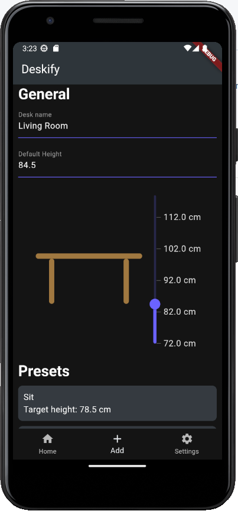
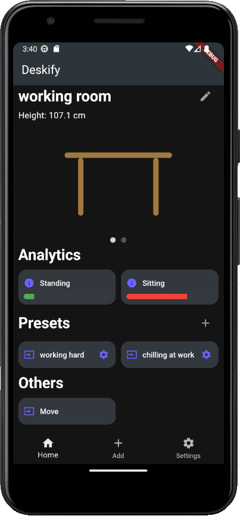
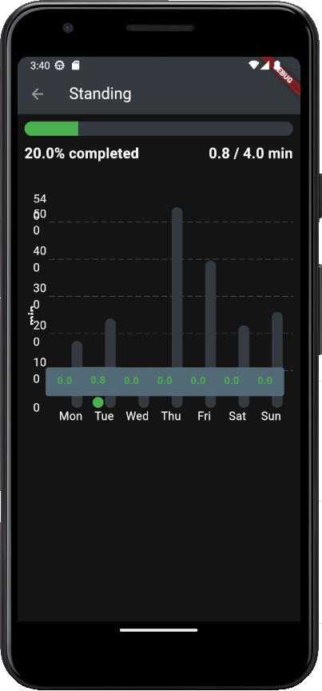
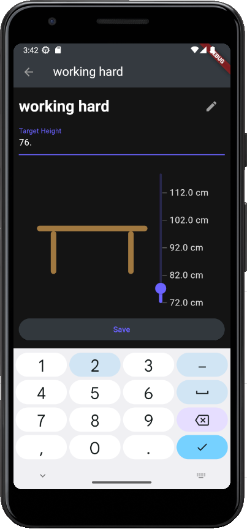
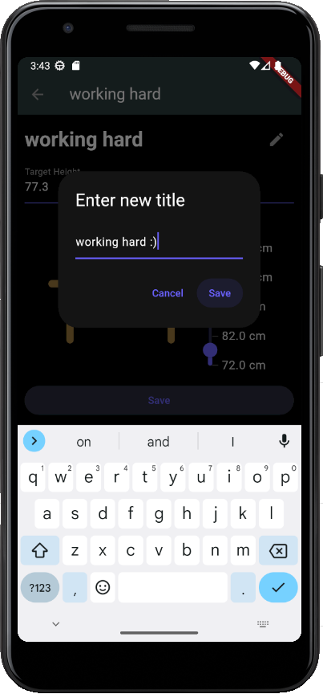
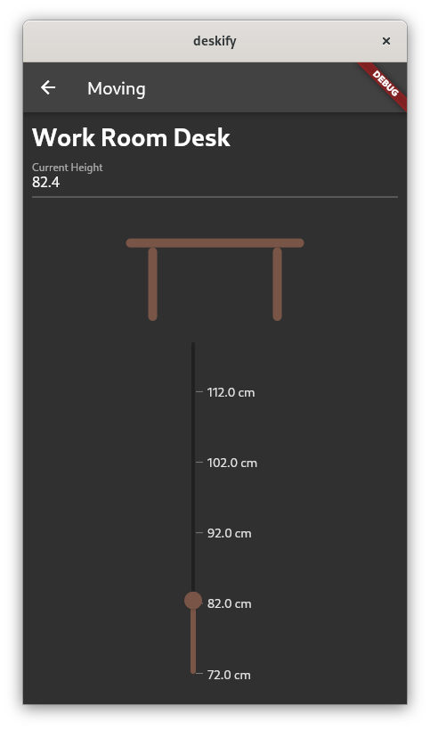
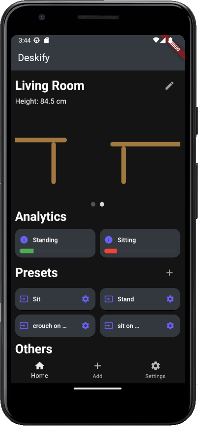
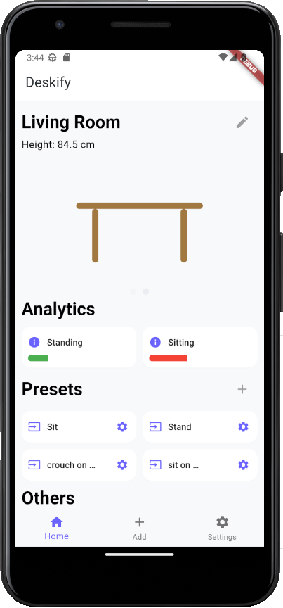

<a name="readme_top"></a>

# Deskify

[![Contributors][contributors_shield]][contributors_url]
[![Forks][forks_shield]][forks_url]
[![Stargazers][stars_shield]][stars_url]
[![Issues][issues_shield]][issues_url]
<br>

## 📑 About the project

An app to manage your desk, and your work. The project is related to a [desk project](https://github.com/MhouneyLH/esphome_custom_components) of mine and is getting developed in the module "mobile development" (`4th` semester) during my studies at the [DHGE](https://www.dhge.de/).

<p align="right">(<a href="#readme_top">back to top</a>)</p>

## 🎆 Showcase

**!!! THIS IS THE LOOK OF THE APP BEFORE I REWORKED IT. WILL BE UPDATED SOON (hopefully) !!!**

### Add new desks



### Get an overview



### Analyse your data



### Configure presets





### Move your desk



### Select between multiple desks



### Interactive feedback through snackbars


### Light mode :)



<p align="right">(<a href="#readme_top">back to top</a>)</p>

## 🔢 Getting started

1. Clone the repository
   ```sh
   git clone https://github.com/MhouneyLH/deskify.git
   ```
2. Install the dependencies
   ```sh
   flutter pub get
   ```
   <p align="right">(<a href="#readme_top">back to top</a>)</p>

## 🧪 Testing

I use [Mocktail](https://pub.dev/packages/mocktail) in combination with [FlutterTest](https://api.flutter.dev/flutter/flutter_test/flutter_test-library.html) for testing.

How to add and run new tests?

1. Create a new file in the `test` folder. The name of the file should be `name_of_the_file_test.dart`. The structure of the test directory should be mirrored to the `lib` directory to keep the structure clean and understandable.
2. Import the needed libraries. (The automatic import does not work all the time sadly)

   ```dart
   import 'package:flutter_test/flutter_test.dart';
   import 'package:mocktail/mocktail.dart';

   // ...
   ```

3. Define your Mock-Classes. (If you need some)

   ```dart
   class MockMyClass extends Mock implements MyClass {}

   // ...
   ```

4. Write your tests. Orientate yourself on existing classes. (Consider when writing tests for multiple methods of a class to use a group for the tests of each method.)

5. Run the tests with the following command:

   ```sh
   flutter test
   ```

   <p align="right">(<a href="#readme_top">back to top</a>)</p>

## 👨🏻‍💼 Contributing

Contributions are always welcome! Please look at following commit-conventions, while contributing: https://www.conventionalcommits.org/en/v1.0.0/#summary 😃

1. Fork the project.
2. Pick or create an [issue](https://github.com/MhouneyLH/deskify/issues) you want to work on.
3. Create your Feature-Branch. (`git checkout -b feat/best_feature`)
4. Commit your changes. (`git commit -m 'feat: add some cool feature'`)
5. Push to the branch. (`git push origin feat/best_feature`)
6. Open a Pull-Request into the Develop-Branch.
<p align="right">(<a href="#readme_top">back to top</a>)</p>

<!-- Links and Images -->

[contributors_shield]: https://img.shields.io/github/contributors/MhouneyLH/deskify.svg?style=for-the-badge
[contributors_url]: https://github.com/MhouneyLH/deskify/graphs/contributors
[forks_shield]: https://img.shields.io/github/forks/MhouneyLH/deskify.svg?style=for-the-badge
[forks_url]: https://github.com/MhouneyLH/deskify/network/members
[stars_shield]: https://img.shields.io/github/stars/MhouneyLH/deskify.svg?style=for-the-badge
[stars_url]: https://github.com/MhouneyLH/deskify/stargazers
[issues_shield]: https://img.shields.io/github/issues/MhouneyLH/deskify.svg?style=for-the-badge
[issues_url]: https://github.com/MhouneyLH/deskify/issues
