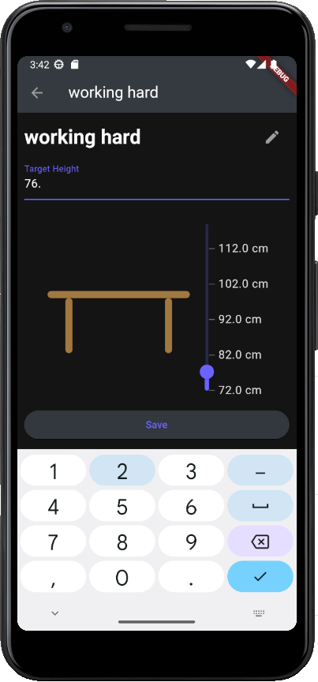
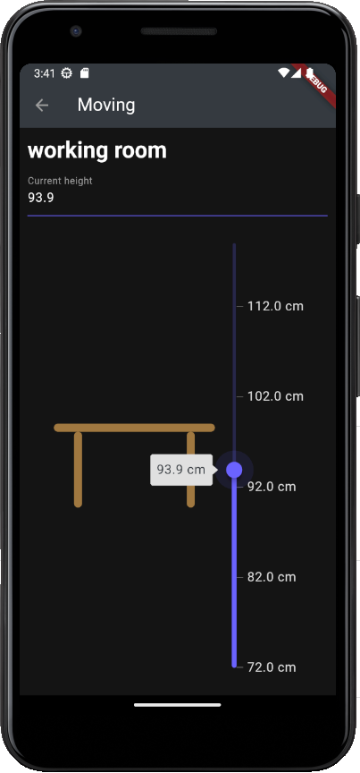
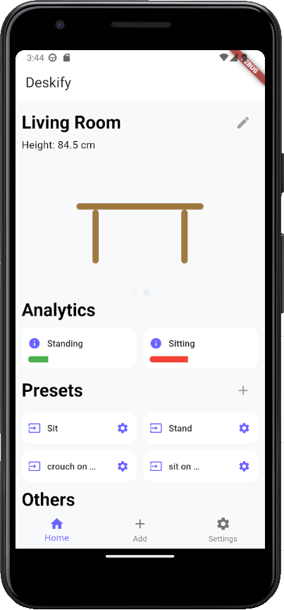

<a name="readme_top"></a>

# Deskify - Lucas Hünniger (PIA21)

> Um die Readme-Datei in einer schöneren Version zu sehen, empfehle ich Ihnen, die Datei auf [GitHub](https://github.com/MhouneyLH/deskify/blob/chore/final_submission/kascheREADME.md) anzusehen.

## Motivation und Idee

Die App dient als Erweiterung für ein Schreibtisch-Automationsprojekt, welches ich in meiner Freizeit begonnen hatte. Die hardwarespezifische Umsetzung des Projektes in diesem [Repository](https://github.com/MhouneyLH/esphome_custom_components) zu finden.

Die App soll es ermöglichen, die Konfigurationen von höhenverstellbaren Schreibtischen zu speichern und zu verwalten. Dies bezieht sich bspw. auf das Speichern von Presets, welche durch den Touchpad-Controller am Schreibtisch lediglich auf eine Anzahl von `3` begrenzt ist. Außerdem werden, anfallende Daten, wie bspw. die Sitz- oder Stehzeiten benutzerfreundlich visualisiert.

<p align="right">(<a href="#readme_top">back to top</a>)</p>

## Entwicklungsfortschritte

### Pretotyp

Große Teile des Pretotyps dienten als Inspiration und wurden tatsächlich in die App übernommen. Manche Dinge sind jedoch bisher nicht umgesetzt bzw. wurden auf eine andere Art und Weise umgesetzt.

Im folgenden wird lediglich ein Ausschnitt des Pretotyps dargestellt. [Hier](https://www.figma.com/file/FN3ZSl7ccE4fye27Pu3vv3/Deskify---Pretotyp?type=design&node-id=0%3A1&t=usGijOKvl9g9N632-1) können Sie den kompletten Pretotyp sehen. Durch Drücken auf den Play-Button (oben rechts) können Sie mit dem Pretotyp interagieren.


### Storyboard

Insgesamt entstanden 4 Varianten des Storyboards, welche die Entwicklung der Applikation verdeutlichen.

- Die 1. Variante war recht simpel und noch nicht gut durchdacht
  
- Die 2. Variante war deutlich ausgereifter und beinhaltet deutlich mehr Funktionalitäten (Grundaufbau der Applikation)
  
- Die 3. Variante enthält einige Änderungen und Verbesserungen, welche für den Kunden umgesetzt wurden
  
- Die 4. Variante ermöglichte es dem Kunden, die wichtigsten Daten zu speichern
  

### Kanboard

Im folgenden wird lediglich ein Ausschnitt des Kanboards dargestellt, auf welchem die Einteilung zu sehen ist. (Backlog, Todo, Doing, Test/Review, Done) Zu beachten ist, dass sich Kanboard und Storyboard füllen immer im Todo befinden, da diese immer wieder erweitert werden.

[Hier](https://uni-lucas.notion.site/9e4461907b4e46bb8bc61898e2d10365?v=4d0e6ded938745fca32b0888b0442445) können Sie das komplette Kanboard sehen.


## Funktionalitäten

### Erstellen neuer Tischkonfigurationen


### Übersicht erhalten


### Einblicke in analytische Daten


### Konfiguration von Presets




### Tische bewegen



### Auswahl zwischen verschiedenen Tischen


### Interaktives Nutzerfeedback durch Snackbars


### Heller Modus



<p align="right">(<a href="#readme_top">back to top</a>)</p>

## Verwendete Pakete

- [`syncfusion_flutter_sliders`](https://pub.dev/packages/syncfusion_flutter_sliders): Konfiguration von vertikalen Slider, um die Höhe des Tisches zu verstellen
- [`provider`](https://pub.dev/packages/provider): State Management
- [`uuid`](https://pub.dev/packages/uuid): Generierung von UUIDs für bspw. die Presets der Desks, um diese eindeutig zu identifizieren
- [`fl_chart`](https://pub.dev/packages/fl_chart): Darstellung von Graphen -> Darstellung der analytischen Daten (Steh- und Sitzzeit)
- [`reorderable_grid`](https://pub.dev/packages/reorderable_grid_view): InteractionWidgets können sortiert werden
- [`carousel_slider`](https://pub.dev/packages/carousel_slider): Wechsel zwischen verschiedenen Tischen
- [`cloud_firestore`](https://pub.dev/packages/cloud_firestore): Speicherung der Daten in der Cloud
- [`firebase_core`](https://pub.dev/packages/firebase_core): Verbindung zur Firebase

<p align="right">(<a href="#readme_top">back to top</a>)</p>

## Installation

> **ACHTUNG**: Zum jetzigen Zeitpunkt verwendet die App Firebase, jedoch ohne Authentifizierung. Ich habe meinen Google-Account bei Firebase hinterlegt und jeder, der die App testen möchte, muss sich mittels `firebase login` mit meinen Daten anmelden. Wenn Sie die App testen möchten, können Sie entweder den (mitgesendeten) älteren Stand der App verwenden oder sich bei mir melden.

1. Installieren der aufgelisteten Abhängigkeiten (Pakete)
   ```sh
   flutter pub get
   ```
2. Starten der App
   ```sh
   flutter run
   ```

<p align="right">(<a href="#readme_top">back to top</a>)</p>

## Lessons Learned

### Bedeutung einer guten Projektstruktur

- am Anfang jeglicher Code in einer Datei -> nach kurzer Zeit sehr unübersichtlich + schwer zu warten + schwer zu skalieren
- Lösung: grundlegende Aufteilung in
  - `api`
  - `model`
  - `provider`
  - `widgets`
    - `generic`
    - ...
    - `tabs`

### Verwendung von Providern für das State Management

- Problem: Daten sollen in der gesamten App verfügbar sein und sich an jeder Stelle updaten, wenn diese sich verändert haben

- 1. versuchter Lösungsansatz: Versuch mit callback-Funktionen zu lösen, habe jedoch schnell gemerkt, dass somit die App nicht skalierbar ist und der Code sehr unübersichtlich wird.
- 2. Lösungsansatz: Verwendung des Paketes `provider` -> sehr einfach zu implementieren und sehr übersichtlich
- Bsp.: Implementierung und Verwendung des DeskProvider für die Verwaltung der Tischdaten

  ```dart
  class DeskProvider with ChangeNotifier {
     ...
     final List<Desk> _desks = [
        Desk(...),
        Desk(...),
        ...
     ];
     int _currentlySelectedIndex = 0;

     Desk get currentDesk => _desks[_currentlySelectedIndex];
     ...

     void addDesk(Desk desk) {
        _desks.add(desk);
        notifyListeners();
     }
  }
  ```

  - Initialisierung der Provider-Klasse

    ```dart
    void main() { ... }
    ...

    @override
    Widget build(BuildContext context) {
          return MultiProvider(
             providers: [
                ChangeNotifierProvider(create: (_) => DeskProvider()),
                ChangeNotifierProvider(create: (_) => ...()),
                ChangeNotifierProvider(create: (_) => ...()),
             ],
             ...
          );
    }
    ```

  - Verwendung des Providers

    ```dart
    Widget build(BuildContext context) {
          final deskProvider = Provider.of<DeskProvider>(context);
          ...

          Text(deskProvider.currentDesk.name);
          ...
    }
    ```

### ReoderableGridView

- tolle Möglichkeit, um Widgets zu sortieren -> Idee ist während der Entwicklung entstanden
- Umstieg von GridView für die Darstellung der Widgets auf ReorderableGridView war sehr leicht, dank externen Package `reorderable_grid`
- Problem: Daten für die draggable Widgets wurden in der Homepage immer wieder überschrieben (wurden bevor Dragging stattfinden konnte immer wieder zurückgesetzt)
- Lösung: nur einmal initialisieren und dann nur noch überschreiben, wenn diese auch überschrieben werden sollen
- nächstes Problem: in `initState()` funktioniert dieses Vorhaben nicht, weil für die Initialisierung der Provider noch kein `context` verfügbar ist (man könnte die Option `listen: false` verwenden, jedoch sind muss man dann selbst Listener definieren)
- Lösung: Umweg über `didChangeDependencies()` (wird direkt nach `initState()` aufgerufen, wodurch Kontext vorhanden ist und die Provider initialisiert werden können)

```dart
@override
void didChangeDependencies() {
  if (!_isInitialized) {
    _initProvider();
    _initInteractionWidgets();
    deskProvider.addListener(() => interactionWidgetProvider.initWidgets());

    _isInitialized = true;
  }

  super.didChangeDependencies();
}

void _initProvider() {
  deskProvider = Provider.of<DeskProvider>(context);
  profileProvider = Provider.of<ProfileProvider>(context);
  themeProvider = Provider.of<ThemeProvider>(context);
  interactionWidgetProvider = Provider.of<InteractionWidgetProvider>(context);
}

void _initInteractionWidgets() {
  ...
  interactionWidgetProvider.initWidgets();
}

```

  <p align="right">(<a href="#readme_top">back to top</a>)</p>

### Firebase - Kostenhölle bei wenig Vorsicht

- am Anfang zunächst einen Streambuilder in Flutter verwendet, um Daten von Firebase zu erhalten
- nach einigen Minuten erhielt ich keine Daten mehr
- Grund: Firebase hat eine Kostenobergrenze von `50.000` Lesevorgängen pro Tag (schreiben und löschen jeweils `20.000` pro Tag) und diese war nach kurzer Zeit ausgereizt, da bei jedem Frame die Daten neu geladen wurden
- Verwendung von einfachen `Future<...>`-Datentypen statt `Streambuilder<...>`
- durch die Verbindung mit Listenern, werden nur dann neue Daten gelesen, wenn sich diese auch in Firebase verändert haben
- Bsp.: Wenn sich die Daten eines Tisches ändern, werden diese neu geladen und die Widgets aktualisieren sich

```dart
void _subscribeToDesks() => FirebaseFirestore.instance
        .collection(FirebaseApi.deskCollectionName)
        .snapshots()
        .listen(
      (snapshot) async {
        final List<Desk> desks = await FirebaseApi.readDesks();
        setDesks(desks);
      },
    );
```

## Besonderheiten

### CarouselSlider mit IndicatorBar

- Nutzen = Wechsel zwischen verschiedenen Tischen
- Verwendung von Beispiel auf der Webseite des Paketes `carousel_slider`, um IndicatorBar einzubauen:

  ```dart
  ...
  Widget _buildCarousel() {
    return CarouselSlider(
      carouselController: buttonCarouselController,
      options: CarouselOptions(
        height: 200.0,
        enableInfiniteScroll: false,
        initialPage: deskProvider.currentlySelectedIndex,
        onPageChanged: (index, _) => _updateDesk(index),
      ),
      items: [
        for (Desk desk in deskProvider.desks) _buildDeskAnimation(desk),
      ],
    );
  }

  Widget _buildIndicatorBar() {
    return Row(
      mainAxisAlignment: MainAxisAlignment.center,
      children: deskProvider.desks.asMap().entries.map((entry) {
        return GestureDetector(
          onTap: () => buttonCarouselController.animateToPage(entry.key),
          child: Container(
            width: 10.0,
            height: 10.0,
            margin: const EdgeInsets.all(5.0),
            decoration: BoxDecoration(
                shape: BoxShape.circle,
                color: (Theme.of(context).colorScheme.secondary).withOpacity(deskProvider.currentlySelectedIndex == entry.key ? 0.9 : 0.3),
            ),
          ),
        );
      },).toList(),
    );
  }
  ```

## Was funktioniert nicht?

- Speichern von Profilinformationen in der Cloud (u. a. die analytischen Daten)
- Reihenfolge der InteractionWidgets wird nicht gespeichert (bei jedem Tischwechsel bzw. Schließen der App geht diese verloren)
- tatsächliche Verbindung per WLAN zu einem Tisch

<p align="right">(<a href="#readme_top">back to top</a>)</p>
